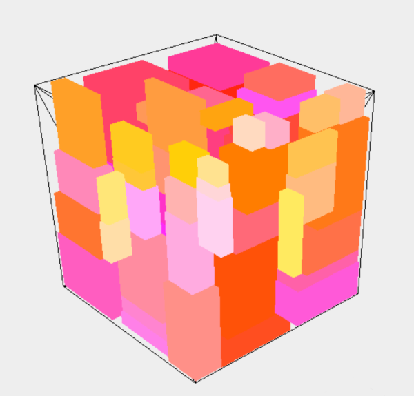

# bin-packing (3D Container packing)

This library packs items into containers. Multiple rectangular items can be packed into multiple rectangular containers.

Implementation is based on Largest Area Fit First algorithm.
Packing here is done quite fast with a reasonable use of space. 




# Usage

## Packing one single container

```java
var container = new BasicContainer(200, 200, 200, 400);

var items = new ArrayList<Item>();
items.add(new BasicItem(30, 60, 40, 10))
//...add more items...

var packer = new LAFFContainerPacker(container);
var result = packer.pack(items);
```


## Packing multiple containers

```java
var containers = new HashSet<Container>();
containers.add(new BasicContainer(200, 200, 200, 400));
//...add more containers...

var items = new ArrayList<Item>();
items.add(new BasicItem(30, 60, 40, 10))
//...add more items...

var listPacker = new ListPacker(LAFFContainerPacker.class, containers);
var result = listPacker.pack(randomItems);
```


# Tweaking points

If one likes to adjust the algorithm or likes to create another packing algorithm, i suggest to start at following points

 - Selecting the Placement: `de.c8121.packing.Placement`:
   When an Item is added, it will be added to a Placement. At first there is one Placement which takes the Item and then creates remainder Placements. When adding the next Item, a appropriate remainder Placement has to be choosen. The selection of the best Placement is a good point to start to adjust the algotithm, see `de.c8121.packing.Placement#findRemainder(Box)`
   
 - Creating & removing remainders:
   As described above, everytime a Item was added, new remainding Placements will be created and previously created remainders might be removed, see `de.c8121.packing.packers.LAFFPacker#setItem(Item)`. These are good points to tweak the algorithm.


# Details

## LAFF algorithm (Largest Area Fit First)

See this paper for more details about the LAFF algorithm: http://www.zahidgurbuz.com/yayinlar/An%20Efficient%20Algorithm%20for%203D%20Rectangular%20Box%20Packing.pdf

For better results, items must be sorted by footprint (bottom area size) and height. Optionaly rotation of items could be performed (see de.c8121.packing.util.ItemRotator)

## See also

- https://github.com/skjolber/3d-bin-container-packing 
  another library using LAFF packing
- https://stackoverflow.com/questions/31186734/3d-bin-packing-algorithms
  to find out more about algorithms

